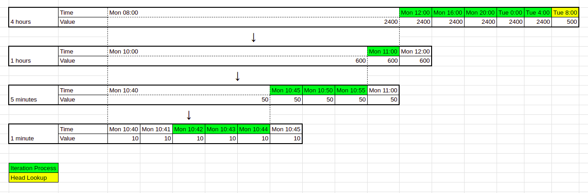

# Go Circuit Breaker

## Description

In memory circuit breaker written in Go. Main utilization for transaction and rate limiter.

## Installation

```sh
go get https://github.com/joshiaj7/go-circuit-breaker
```

## Usage

Circuit breaker initialization:

```go
package circuitbreaker

import (
	"log"
	"time"

	goCache "github.com/patrickmn/go-cache"
)

func main() {
	defaultExpiration := 5 * time.Minute
	purgeDuration := 5 * time.Minute

	// implements Adapter interface
	gocache := goCache.New(defaultExpiration, purgeDuration)

	// create cache
	cache := NewCache(gocache, defaultExpiration)

	// create buckets, the more, the better lookup performance
	buckets := []*Bucket{
		NewBucket(1 * time.Minute),
		NewBucket(5 * time.Minute),
		NewBucket(1 * time.Hour),
		NewBucket(4 * time.Hour),
	}

	// how long the data in redis live
	cacheTTL := 28 * time.Hour

	// feature name as identifier for time point in redis
	featureName := "my-cb"

	// window duration of a circuit breaker
	windowDuration := 24 * time.Hour

	// create new circuit breaker
	cb := NewCircuitBreaker(buckets, cache, cacheTTL, featureName, windowDuration)

	// update the circuit breaker status, threshold, and warning threshold
	cb.SetActive(true)
	cb.SetWarningThreshold(400)
	cb.SetThreshold(500)

	incomingTransactionAmount := 300

	if cb.GetActive() {
		// check warning threshold
		if cb.IsExceedingWarningThreshold(incomingTransactionAmount) {
			log.Fatal("warning threshold exceeded")
			cb.UpdateTripWarning(true)
		}

		// check threshold
		if cb.IsExceedingThreshold(incomingTransactionAmount) {
			log.Fatal("threshold exceeded")
			cb.UpdateTrip(true)
			return
		}
	}

	err := cb.UpdateLatestBucketsValue(incomingTransactionAmount)
	if err != nil {
		log.Fatal("update buckets value failed")
		return
	}
}
```

## Lookup strategy

CalculateWindowValue is implementing time-series data analysis, aggregation, and sliding windows. The bigger the bucket, the better performance it yields.

Suppose we have the following conditions:

| Constrain              | Value                         |
|------------------------|-------------------------------|
| Request amount         | 30                            |
| Time now               | May 9, 2023 Tuesday, 10:42 AM |
| Circuit breaker window | 1 day                         |

Therefore, the range would be from May 8, 2023  Monday, 10:42 AM to  May 9, 2023  Tuesday, 10:42 AM



The iteration process is going backward from:
* 4 hours bucket →  Tue 4:00 to Mon 12:00 = 2400 + 2400 + 2400 + 2400 + 2400 = 12000
* 1 hour bucket → Mon 11:00 = 600
* 5 minutes bucket → Mon 10:55 to Mon 10:45 = 50 + 50 + 50 = 150
* 1 minute bucket → Mon 10:44 to Mon 10:42 = 10 + 10 + 10 = 30


As for the head, we don’t need to iterate the keys, just lookup by the latest value of the biggest bucket. In this case Tue 8:00 

Therefore, we have the value of the window, 12000 + 600 + 150 + 30 + 500 = 13280
